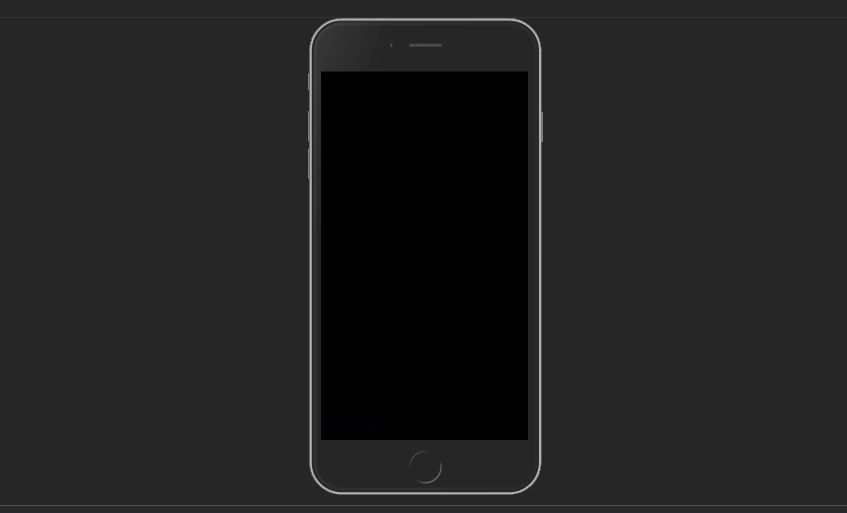

# Today In Science
An app that utilizes two APIs to bring the user the most recent articles focused on the popular fields of Science today, such as Astronomy, Astrobiology, Quantum Physics and Quantum Computing. These are just some of the topics covered. Many more fields of Science are available to the user, so they can catch up on the latest research findings with the Today In Science app.  

## Technologies Used

- jQuery/AJAX
- Javascript
- Bootstrap 4
- CSS3
- HTML5


## Live Demo

Coming Soon!

## Features

- User can select a field of choice in Science and read the most recent news on that subject.
- User is given a list of articles, each of which containing the article's publish date, headline, and a brief description about the article's content.
- User can select an article, and they will be sent to the website which published the article, so they may read it in its entirety.
- User has access to resources outside of the app, such as NASA.COM, SPACE.COM and SETI.ORG via links.

## Preview



## Development

### System Requirements

- none

### Getting Started

1. Clone the repository.

    ```shell
    git clone https://github.com/JaimeGSandoval/today-in-science.git
    cd today-in-science
    ```

